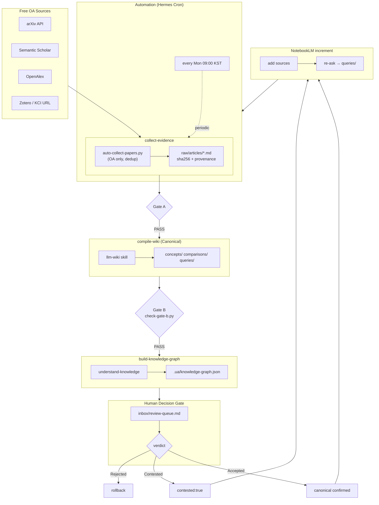

# 2nd Brain Template — UAV Swarm Research Edition

[**English**](README.en.md) | 한국어

> An evidence-first, Markdown-based knowledge-management template that collects scattered papers, web pages, and notes in one place and connects them by provenance to drive real research and operational decisions.
> This fork is tuned for **UAV Swarm** research and is actively running: it ships a Hermes Agent cron, NotebookLM increment workflow, and an automated free-OA paper collector.

## Introduction

We run a **collect → compile → connect → verify → automate** loop rather than just storing notes. Every note is plain Markdown, so it is not locked to any app and opens in Obsidian, VS Code, or GitHub.

### Full workflow (our system)



Pipeline detail: [docs/workflow/second-brain-pipeline.md](docs/workflow/second-brain-pipeline.md)

### Tech stack

The durable assets are **open-format sources, canonical Markdown, provenance metadata, and Git history**. The tools below are interchangeable layers.

| Layer | Tool |
| --- | --- |
| Edit | Obsidian, VS Code |
| Paper capture | Zotero + Connector, arXiv/S2/OpenAlex API |
| AI compile | Hermes Agent + `llm-wiki` skill |
| Query increment | NotebookLM CLI (`notebooklm-py`) |
| Graph | Understand Anything `understand-knowledge` |
| Automation | Hermes Cron (`second-brain-collect-review`, Mon 09:00 KST) |

## Key features

- **Source preservation** — papers/web captured to `raw/` with sha256 + provenance
- **Free OA auto-collect** — `docs/workflow/auto-collect-papers.py` pulls OA papers from arXiv/S2/OpenAlex, downloads PDFs
- **Verified compile** — `llm-wiki` structures sources into canonical pages (Gate B)
- **Knowledge graph** — `understand-knowledge` builds `.ua/` (128 nodes)
- **Human gate** — `inbox/review-queue.md` verdict; no auto-promotion
- **NotebookLM increment** — add sources → re-ask → compile verified synthesis into `queries/`
- **Weekly automation** — cron collects new OA papers + refreshes review queue → Telegram report

## Install

For editing only, Obsidian suffices. For the full pipeline, set up in order:

1. [Obsidian](https://obsidian.md/download) — open this repo as a vault
2. [Zotero](https://www.zotero.org/download/) + Connector — paper capture
3. Hermes Agent — add `web` to `platform_toolsets.cli`; link `llm-wiki` + `understand-knowledge` skills
4. `notebooklm-py` — install + Google login
5. Register cron `second-brain-collect-review` (Mon 09:00 KST, workdir set)

## Folder structure

```
./  raw/articles/  raw/papers/  concepts/  comparisons/  queries/  entities/
    docs/workflow/  inbox/review-queue.md  SCHEMA.md  index.md  log.md
```

## Rules

- `raw/` bodies are **immutable** — sha256 integrity
- canonical pages follow `confidence` / `sources` / `wikilink≥2`
- automation writes `raw/` only; canonical promotion always awaits human verdict

## Status (this repo)

- 15 canonical pages; 30+ captured sources (KCI 1 + arXiv 21 + Zotero 9)
- UAV swarm topics: formation control, MARL, path planning, decentralized C2, security, 5 autonomy pillars
- `combat-swarm-drone-operations` at `confidence: high`

---

Forked from [ains-lab/2nd-brain-template](https://github.com/ains-lab/2nd-brain-template), extended as a UAV Swarm research example.
