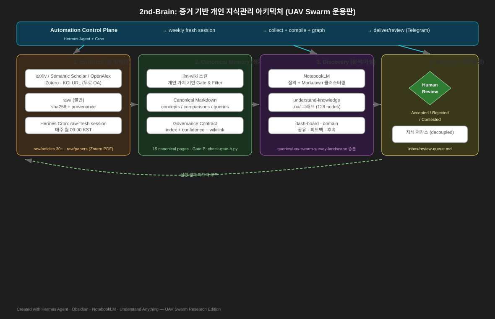
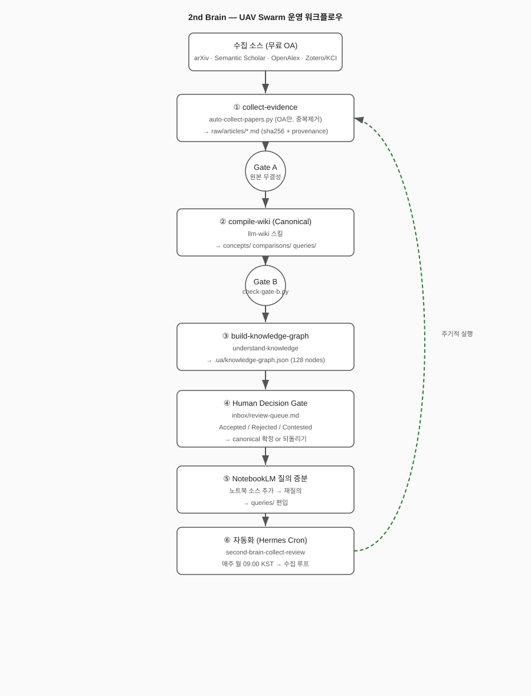

# 2nd Brain Template

[English](README.md) | **한국어**

> 흩어진 생각과 정보를 한곳에 모으고, 서로 연결해 실제 행동으로 이어 가기 위한 Markdown 기반 지식 관리 템플릿입니다.

## 프로젝트 소개

이 프로젝트는 메모를 단순히 보관하는 데서 끝내지 않고 **수집 → 정리 → 연결 → 실행 → 회고**의 흐름으로 운영합니다. 모든 노트는 일반 Markdown 파일로 관리하므로 특정 앱에 종속되지 않으며, Obsidian·VS Code·GitHub 등 원하는 도구에서 사용할 수 있습니다.

이 포크는 **군집드론(UAV Swarm) 연구**에 맞춰 실제 운용 중이며, Hermes Agent 크론, NotebookLM 증분 워크플로, 무료 OA 논문 자동 수집기(`docs/workflow/auto-collect-papers.py`)를 포함합니다.

### 전체 아키텍처

[전체 아키텍처](docs/architecture/second-brain-pkm-architecture.md)는 **Evidence → Canonical Memory → Discovery → Human Decision**의 네 계층으로 구성됩니다. 원본과 메타데이터는 불변 evidence로 보존하고, 반복해서 사용할 지식만 출처와 함께 canonical Markdown으로 컴파일합니다. NotebookLM과 지식그래프에서 발견한 관계는 가설로 취급하며, 사람의 검증을 통과한 내용만 장기 기억으로 승격합니다.



### 운영 워크플로

[운영 워크플로](docs/architecture/second-brain-pkm-architecture.md#6-핵심-워크플로우)는 **Capture → Compile → Discovery → Human Decision** 순서로 진행됩니다. 각 단계는 무결성·frontmatter·구조 검증 관문을 통과해야 다음 단계로 이동하며, 승인된 변경은 canonical 문서·index·log를 함께 갱신한 뒤 지식그래프와 재사용 산출물로 환류됩니다.



### 기술 스택

[기술 스택](docs/architecture/second-brain-pkm-architecture.md#5-기술-스택)의 핵심 자산은 특정 제품이 아니라 **공개 형식의 원본, canonical Markdown, 출처 메타데이터와 Git 이력**입니다. Obsidian·Zotero·NotebookLM·Understand Anything은 수집, 편집, 탐색과 분석을 담당하는 교체 가능한 도구이며, 무결성 검사와 사람의 승인 관문이 전체 스택을 연결합니다.


## 2nd-Brain 주요 기능

원본을 안전하게 보존하는 것부터 검증된 지식을 다시 활용하는 것까지 하나의 순환으로 연결합니다.

| 주요 기능 | 설명 |
| --- | --- |
| **원본·출처 보존** | Zotero, arXiv/S2/OpenAlex API로 논문·웹을 수집하고, `raw/`에 원본·메타데이터·SHA-256을 보존해 언제든 근거로 돌아갑니다. |
| **무료 OA 자동 수집** | `docs/workflow/auto-collect-papers.py`가 arXiv·Semantic Scholar·OpenAlex에서 OA 논문만 수집·중복제거하고 PDF를 `raw/papers/files/`에 받습니다. |
| **검증된 지식 컴파일** | [LLM Wiki](concepts/llm-wiki.md)가 원본을 개념·비교·질의 문서로 구조화하고 출처, 신뢰도, 모순과 연결 관계를 누적합니다. |
| **연결형 탐색과 편집** | [세컨드 브레인 연구 워크플로](concepts/second-brain-research-workflow.md)에 따라 Obsidian에서 Markdown, 위키링크와 역링크로 장기 지식을 읽고 편집합니다. |
| **출처 기반 집중 연구** | [NotebookLM 질의 증분 워크플로](queries/notebooklm-query-compounding.md)로 제한된 소스를 질의하고, 재사용 가치가 검증된 결과만 정식 질의 문서에 편입합니다. |
| **지식그래프 분석** | [UA 지식그래프 워크플로](queries/ua-knowledge-graph-workflow.md)로 군집·브리지·고립 문서와 지식 공백 후보를 찾고 그래프 결과를 원문으로 재검증합니다. |
| **사람 검증과 피드백** | [연구 피드백 루프](concepts/research-feedback-loop.md)가 탐색 결과를 수용·논쟁·보류·기각으로 판정하고, 승인된 지식만 인덱스와 변경 기록에 환류합니다. |
| **주간 자동화** | Hermes Cron `second-brain-collect-review`(매주 월 09:00 KST)가 새 OA 논문을 자동 수집하고 `inbox/review-queue.md`를 갱신한 뒤 Telegram으로 보고합니다. |

## 사전 설치

일반 Markdown 편집만 필요하다면 Obsidian만 설치해도 시작할 수 있습니다. 웹·논문 수집부터 AI 기반 지식 정리와 그래프 탐색까지 전체 워크플로를 사용하려면 아래 도구를 순서대로 준비하세요.

### 앱과 데이터 수집 도구

| 구분 | 도구 | 용도 및 설치 방법 |
| --- | --- | --- |
| 필수 | [Obsidian](https://obsidian.md/download) | 이 저장소를 로컬 vault로 열어 Markdown 노트를 탐색하고 편집합니다. |
| 논문 수집 | [Zotero 및 Zotero Connector](https://www.zotero.org/download/) | Zotero 데스크톱 앱으로 논문·PDF·서지 정보를 관리하고, 같은 다운로드 페이지에서 Chrome용 Connector를 설치해 웹의 논문 정보를 Zotero로 저장합니다. |
| 웹 수집 | [Obsidian Web Clipper](https://obsidian.md/clipper) | Chrome에서 웹 페이지와 메타데이터를 Markdown으로 변환해 Obsidian vault에 저장합니다. |

### AI 자동화 도구

다음 항목은 에이전트를 이용해 수집 자료를 가져오고, 지식 노트로 정리하거나 시각화할 때 사용합니다. Obsidian 플러그인이 아니라 MCP 서버, CLI 또는 에이전트 스킬입니다.

> [!IMPORTANT] 에이전트 환경에 맞게 설치하세요
> MCP 설정 파일, 프로젝트·로컬 스킬 경로, 플러그인 지원 방식과 재시작 절차는 에이전트마다 다릅니다. 아래 링크의 공식 설치 문서를 먼저 읽고 현재 사용하는 에이전트 또는 MCP 클라이언트에 맞는 방법을 선택하세요. 다른 에이전트용 설정과 명령을 그대로 복사하지 마세요.

| 도구 | 역할 | 설치 안내 |
| --- | --- | --- |
| [Zotero MCP](https://github.com/54yyyu/zotero-mcp) | 에이전트가 Zotero 서지·첨부·노트·전문에 접근하게 함 | 공식 저장소 지침에 따라 MCP 클라이언트에 서버 등록 |
| [`llm-wiki`](https://github.com/ains-lab/harness/tree/main/skills/llm-wiki) | 수집 원본을 출처 추적 가능한 Markdown 지식베이스로 컴파일·검증 | 공식 스킬 문서 + 에이전트 스킬 설치 가이드 준수 |
| [notebooklm-py](https://github.com/teng-lin/notebooklm-py) | NotebookLM 노트북·소스를 CLI로 관리하고 근거 기반 질의 자동화 | 공식 설치·인증 문서 준수 |
| [Understand Anything](https://github.com/Egonex-AI/Understand-Anything) | 코드·지식베이스 관계를 분석해 대화형 지식그래프 생성 | 공식 저장소의 에이전트/개발환경 설치법 선택 |
| **Hermes Agent** (이 포크) | 주간 `second-brain-collect-review` 크론과 `auto-collect-papers.py` 수집기 실행 | `~/.hermes/config.yaml`의 `platform_toolsets.cli`에 `web` 추가, `llm-wiki`+`understand-knowledge` 스킬 연결, workdir 지정 크론 등록 |

> [!NOTE]
> `notebooklm-py`는 비공식 Google API를 쓰므로 서비스 변경 영향이 있을 수 있습니다. Google 로그인 세션·Zotero API 키 등 인증 정보는 이 저장소에 커밋하지 마세요.

### 권장 설치 순서

1. Obsidian 설치 후 이 저장소 디렉토리를 vault로 열기
2. Zotero 데스크톱·Connector·Obsidian Web Clipper 설치
3. 각 공식 링크의 환경·사전조건 확인
4. Zotero MCP 문서 따라 현재 MCP 클라이언트에 Zotero 연결
5. `llm-wiki`·Understand Anything을 공식 문서 + 에이전트 스킬 규칙에 맞게 설치
6. 필요시 `notebooklm-py` 설치 후 공식 문서로 인증
7. (이 포크) Hermes Agent `web` toolset 설정 + `second-brain-collect-review` 크론 등록

## 권장 디렉토리 구조

저장소 루트가 위키 루트이자 Obsidian vault입니다. 별도 데이터베이스 없이 모든 경로는 이 루트 기준으로 해석되며, [SCHEMA.md](SCHEMA.md)가 디렉토리·데이터 무결성 계약을 정의합니다.

```text
.
├── inbox/                    # 분류 전 임시 입력
├── raw/                      # 불변 원본 증거
│   ├── articles/             # 논문·웹 클리핑 원문 (arXiv/KCI 레코드)
│   ├── notebooklm/           # NotebookLM에서 가져온 원본 레코드
│   ├── papers/files/         # 논문 첨부 (필요 시에만)
│   ├── transcripts/          # 오디오·영상·회의 전사
│   ├── web/                  # 임포터 경로 보존 웹 캡처
│   ├── youtube/              # YouTube 메타·전사
│   └── assets/               # 원본이 참조하는 이미지·첨부
├── entities/                 # 사람·조직·도구에 대한 canonical 지식
├── concepts/                 # 개념·원리·방법에 대한 canonical 지식
├── comparisons/              # 도구·방법 side-by-side 분석
├── queries/                  # 출처 기반 질문과 합성 답변
├── docs/                     # 아키텍처·워크플로·기술스택 산출물
│   ├── architecture/
│   ├── tech-stack/
│   └── workflow/
├── templates/                # 검증된 노트 템플릿 (필요 시에만)
├── _archive/                 # 완전히 대체된 canonical (필요 시에만)
├── .obsidian/                # 공유 Obsidian 설정
├── SCHEMA.md                 # 디렉토리·메타·무결성 계약
├── index.md                  # 활성 canonical 전체 카탈로그
└── log.md                    # append-only 운영 기록
```

`raw/papers/files/`, `templates/`, `_archive/`는 워크플로가 필요할 때만 생성됩니다. `.ua/` 같은 지식그래프 캐시는 재생산 가능한 파생 데이터라 canonical 지식이나 원본 증거로 다루지 않습니다.

### 구조의 의미

| 범주 | 위치 | 의미와 관리 |
| --- | --- | --- |
| 임시 입력 | `inbox/` | 형식·분류가 정해지지 않은 입력. 증거·canonical 어느 쪽도 아님. 결국 `raw/`로 캡처하거나 제거 |
| 계층 1 원본 증거 | `raw/` | 캡처한 본문과 출처 메타 보존. 초기 캡처 후 본문은 불변. 수정·해석은 canonical로 |
| canonical 지식 | `entities/ concepts/ comparisons/ queries/` | 출처 연결 Markdown. 중심 주제거나 2+ 소스 반복 시에만 생성 |
| 산출물 | `docs/` | 아키텍처·워크플로·기술스택 다이어그램. 증거·canonical 아님 |
| 카탈로그·이력 | `index.md`, `log.md` | index는 활성 canonical 수와 일치, log는 append-only·재작성 금지 |

## 현재 상태 (이 포크)

- **canonical 페이지 15개** (concepts 5, queries 2, comparisons 1, entities 1, 기타 기본 페이지)
- **수집 원본 30+** — KCI 1 + arXiv 21 + Zotero 9
- **군집드론 주제**: 형성제어, MARL, 경로계획, 탈중앙 C2, swarm 보안, 완전 자율화 5대 과제
- `concepts/combat-swarm-drone-operations.md` 는 `confidence: high`
- 자동 수집기가 주간 Hermes 크론에 연결됨

---

[ains-lab/2nd-brain-template](https://github.com/ains-lab/2nd-brain-template)에서 포크. UAV Swarm 연구 운용 예시로 확장.
