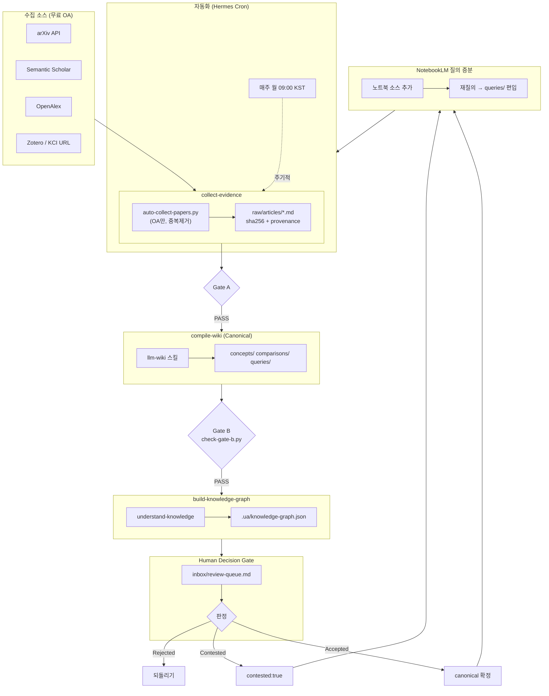

# 2nd Brain Template — UAV Swarm Research Edition

[English](README.en.md) | **한국어**

> 흩어진 논문·웹·노트를 한곳에 모으고, 출처 기반으로 연결해 실제 연구·운용 판단으로 이어 가기 위한 **Markdown 기반 증거 우선 지식관리 템플릿**입니다.
> 이 포크는 **군집드론(UAV Swarm) 연구**에 맞춰 실제 운용 중이며, Hermes Agent 자동화 크론·NotebookLM 증분·무료 OA 논문 자동 수집 파이프라인이 포함돼 있습니다.

## 프로젝트 소개

메모를 보관하는 데 그치지 않고 **수집 → 정리 → 연결 → 검증 → 자동화**의 흐름으로 운영합니다. 모든 노트는 일반 Markdown이라 특정 앱에 종속되지 않으며, Obsidian·VS Code·GitHub 어디서나 엽니다.

### 전체 워크플로우 (우리 시스템)



상세 파이프라인: [docs/workflow/second-brain-pipeline.md](docs/workflow/second-brain-pipeline.md)
다이어그램 소스: [docs/workflow/second-brain-workflow.svg](docs/workflow/second-brain-workflow.svg)

### 기술 스택

공개 형식의 **원본·canonical Markdown·출처 메타·Git 이력**이 핵심 자산이며, 아래 도구는 교체 가능한 레이어입니다.

| 계층 | 도구 |
| --- | --- |
| 편집 | Obsidian, VS Code |
| 논문 수집 | Zotero + Zotero Connector, arXiv/S2/OpenAlex API |
| AI 정리 | Hermes Agent + `llm-wiki` 스킬 |
| 질의 증분 | NotebookLM CLI (`notebooklm-py`) |
| 그래프 | Understand Anything `understand-knowledge` |
| 자동화 | Hermes Cron (`second-brain-collect-review`, 매주 월 09:00 KST) |

## 주요 기능

| 기능 | 설명 |
| --- | --- |
| **원본·출처 보존** | 논문·웹을 `raw/`에 수집, sha256 + provenance 기록으로 근거 보존 |
| **무료 OA 자동 수집** | `docs/workflow/auto-collect-papers.py` — arXiv/S2/OpenAlex에서 OA 논문만 자동 수집·PDF 다운로드 |
| **검증된 지식 컴파일** | `llm-wiki`가 원본을 concept/comparison/query로 구조화 (Gate B 검증) |
| **지식그래프** | `understand-knowledge`로 `.ua/` 노드·엣지 생성 (128 nodes) |
| **사람 검증 게이트** | `inbox/review-queue.md`에서 Accepted/Rejected 판정 — 자동 승격 없음 |
| **NotebookLM 증분** | 노트북 소스 추가 → 재질의 → `queries/`에 검증된 합성만 편입 |
| **주간 자동화** | 크론이 매주 새 OA 논문 수집 + 리뷰 큐 갱신 → Telegram 보고 |

## 사전 설치

편집만 원하면 Obsidian만 있으면 됩니다. 전체 파이프라인은 아래 순서로 설치하세요.

### 앱

| 도구 | 용도 |
| --- | --- |
| [Obsidian](https://obsidian.md/download) | vault로 열기 |
| [Zotero](https://www.zotero.org/download/) | 논문·PDF 관리 + Connector |
| [Obsidian Web Clipper](https://obsidian.md/clipper) | 웹 → Markdown |

### AI 자동화 (Hermes Agent)

- Hermes Agent 설치 후 `platform_toolsets.cli`에 `web` 추가 (자동 수집용)
- `llm-wiki`, `understand-knowledge` 스킬 연동
- `notebooklm-py` 설치 + Google 로그인
- 크론 등록: `second-brain-collect-review` (매주 월 09:00 KST, workdir 지정)

## 폴더 구조

```
./
├── raw/articles/      # 수집된 논문 (sha256)
├── raw/papers/        # Zotero PDF
├── concepts/          # canonical: 개념
├── comparisons/       # canonical: 비교
├── queries/           # canonical: 질의 합성
├── entities/          # canonical: 개체
├── docs/workflow/     # 파이프라인·스크립트·다이어그램
├── inbox/review-queue.md  # 사람 검증 게이트
├── SCHEMA.md          # 운영 계약 (준수 필수)
├── index.md           # canonical 카탈로그
└── log.md             # append-only 운영 기록
```

## 규칙 (핵심)

- `raw/` 본문은 **불변** — sha256로 무결성 보증
- canonical 페이지는 `confidence`·`sources`·`wikilink≥2` 규칙 준수
- 자동화는 **raw/까지만** 작성, canonical 승격은 항상 사람 판정 후

## 현재 상태 (이 repo)

- canonical 페이지: 15개 (concepts 5, queries 2, comparisons 1, entities 1, + 기타)
- 수집 원본: KCI 1 + arXiv 21 (+ Zotero 9) ≈ 30+ 편
- 군집드론 중심 주제: 형성제어, MARL, 경로계획, 탈중앙 C2, 보안, 완전 자율화 5대 과제
- `combat-swarm-drone-operations` 는 `confidence: high`

---

Forked from [ains-lab/2nd-brain-template](https://github.com/ains-lab/2nd-brain-template). UAV Swarm 연구 운용 예시로 확장.
