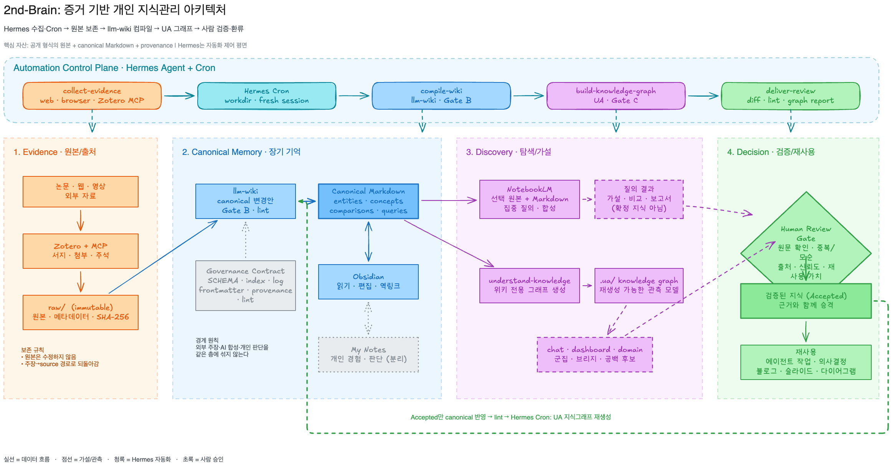

# 2nd-Brain: 증거 기반 개인 지식관리 기술 아키텍처

> 문서 상태: 제안 아키텍처 1.1  
> 작성일: 2026-07-21  
> 적용 대상: Markdown/Obsidian 기반 개인 지식관리 저장소

이 문서는 개인 지식관리 시스템의 아키텍처, 기술 스택, 운영 워크플로우를 정의한다. 핵심 목표는 자료를 많이 저장하는 것이 아니라, **원본으로 돌아갈 수 있고, 검증된 지식을 반복해서 재사용하며, 도구가 바뀌어도 핵심 자산이 남는 2nd-Brain**을 만드는 것이다.

## 1. 아키텍처 결정 요약

이 시스템은 하나의 앱에 모든 책임을 맡기지 않는다. 데이터의 신뢰 수준과 수명을 기준으로 다음 네 계층을 분리한다.

1. **Evidence:** 원본과 출처 메타데이터를 변경하지 않고 보존한다.
2. **Canonical Memory:** 반복 사용할 가치가 있는 내용을 출처가 연결된 Markdown 지식으로 컴파일한다.
3. **Discovery:** 제한된 소스 질의와 지식그래프 분석으로 가설, 브리지, 공백 후보를 찾는다.
4. **Decision:** 사람이 원문, 중복, 모순, 신뢰도와 재사용 가치를 검토해 지식 승격 여부를 결정한다.

이 네 계층을 가로지르는 **Automation Control Plane**은 Hermes Agent가 담당한다. Hermes는 허용된 소스에서 자료를 수집하고, Cron 작업으로 `llm-wiki` 컴파일과 Understand Anything(UA) 지식그래프 생성을 예약한다. 자동화 계층은 새로운 신뢰 계층이나 정본 저장소가 아니며, 각 단계는 기존 Evidence·Governance·Decision 관문을 통과해야 한다.

운영의 중심 자산은 특정 제품의 데이터베이스가 아니라 다음 세 가지다.

- 공개 형식으로 보존된 원본 또는 원본을 가리키는 안정적인 메타데이터
- YAML frontmatter와 위키링크를 가진 Markdown 문서
- 출처, 변경 이력, 품질 규칙을 명시한 거버넌스 계약

NotebookLM 답변과 지식그래프의 추론 관계는 유용한 **가설**이지만 그 자체로 정본 지식은 아니다. 사람이 검증하고 출처를 연결한 내용만 Canonical Memory로 승격한다.

## 2. 설계 원칙

### 2.1 Evidence first

요약이나 해석보다 원본 보존이 먼저다. `raw/`에 들어간 원본 본문은 수정하지 않고, 오류 정정과 해석은 canonical 문서에서 수행한다. 원본의 수집 시점, 출처 식별자, 서지정보와 SHA-256은 다시 원문으로 돌아가기 위한 복구 경로다.

### 2.2 원본과 해석의 분리

외부 출처의 주장, AI의 합성, 개인의 경험과 판단을 같은 층에 섞지 않는다. 각 문장은 어느 계층에서 왔는지 식별할 수 있어야 한다. 개인 판단의 저장 정책이 별도로 정의되지 않았다면 canonical 사실처럼 기록하지 않는다.

### 2.3 컴파일된 장기 기억

Canonical Memory는 원본 전체를 복사한 저장소가 아니다. 자주 재사용할 개념, 엔티티, 비교, 검증된 질의를 구조화한 지식 계층이다. 기존 문서를 갱신할 수 있다면 동의어 페이지를 새로 만들지 않는다.

### 2.4 재생성 가능한 파생 상태

`.ua/knowledge-graph.json`, NotebookLM 대화, 검색 색인, 대시보드와 내보낸 산출물은 원본과 canonical Markdown에서 다시 만들 수 있는 파생 상태다. 이 상태를 정본으로 취급하거나 canonical 문서를 역으로 덮어쓰지 않는다.

### 2.5 사람 승인 관문

자동화는 수집, 후보 생성, 형식 검사와 그래프 재생성을 돕는다. 다음 판단은 사람이 소유한다.

- 새 지식이 실제로 재사용할 가치가 있는가?
- 주장의 출처가 충분하고 원문과 일치하는가?
- 기존 문서와 중복되거나 충돌하지 않는가?
- AI 합성, 외부 주장, 개인 판단이 분리되어 있는가?
- 빠르게 변하는 정보에 날짜와 적절한 신뢰도를 부여했는가?

## 3. 논리 아키텍처



편집 가능한 원본은 [Excalidraw](./second-brain-pkm-architecture.excalidraw), 벡터 버전은 [SVG](./second-brain-pkm-architecture.svg)로 제공한다.
위 그림은 핵심 데이터·신뢰 계층과 이를 가로지르는 Hermes Automation Control Plane을 함께 보여주며, 아래 실행 흐름과 7장은 단계별 작업 계약과 실패 격리를 설명한다.

```text
허용된 외부 자료
  → Hermes Agent 수집(web·browser·Zotero MCP)
  → inbox/ 후보 또는 raw/ 불변 원본
  → raw 무결성 관문
  → Hermes Cron: llm-wiki 컴파일
  → canonical Markdown + index.md + log.md
  → wiki lint 관문
  → Hermes Cron: UA 지식그래프 생성
  → graph/meta 검증
  → 사람 검토 → Accepted·Contested·Deferred·Rejected
                  │
                  └→ canonical 갱신 → lint → 그래프 재생성
```

### 3.1 계층별 책임

| 계층 | 책임 | 주요 입력 | 지속 데이터 | 출력 | 신뢰 경계 |
| --- | --- | --- | --- | --- | --- |
| Evidence | 원본과 서지정보 보존 | 논문, 웹, 영상, 회의록 | `raw/**`, Zotero 라이브러리 | 추적 가능한 원본 레코드 | 원본 본문은 불변 |
| Canonical Memory | 지식을 선별·요약·비교·연결 | raw 레코드 | `entities/`, `concepts/`, `comparisons/`, `queries/` | 재사용 가능한 Markdown | 출처·링크·스키마 검증 필요 |
| Governance | 형식과 변경 이력 통제 | 저장소 변경 | `SCHEMA.md`, `index.md`, `log.md` | 유효성 판정과 감사 이력 | `SCHEMA.md`가 최종 계약 |
| Automation Control Plane | 수집, 예약 실행, 단계 전환과 결과 전달 | 허용 소스, 스케줄, 검증 상태 | vault 외부의 Hermes 작업 정의·실행 이력 | raw 후보, wiki 변경안, 그래프 재생성 | 품질 관문과 사람 승인을 우회할 수 없음 |
| Discovery | 관계와 가설 탐색 | 선택한 원본, canonical 문서 | NotebookLM 작업공간, `.ua/**` | 질의 결과, 군집·브리지·공백 후보 | 결과는 가설이며 재검증 필요 |
| Decision & Reuse | 승인, 보류, 산출물화 | 탐색 결과와 원문 | 승인된 canonical 갱신, `docs/` 산출물 | 의사결정, 글, 슬라이드, 다이어그램 | 사람이 최종 승인 |

### 3.2 제어 평면과 데이터 평면

데이터 평면은 `raw/`와 canonical Markdown이다. 제어 평면은 `SCHEMA.md`, `index.md`, `log.md`, 검증기와 사람 검토다. 도구가 쓰기 작업을 수행하려면 데이터 평면만 바꾸는 것이 아니라 제어 평면까지 같은 트랜잭션에서 동기화해야 한다.

```text
Hermes Agent·Cron ── 예약·오케스트레이션 ──────────────┐
SCHEMA.md         ── 규칙 ──┐                         │
index.md          ── 탐색 ──┼→ canonical Markdown → UA
log.md            ── 감사 ──┘           ↑             │
raw/**            ── 근거 ───────────────┴─────────────┘
```

## 4. 저장소와 데이터 모델

### 4.1 기준 디렉터리

```text
2nd-brain-template/
├── inbox/                  # 미분류 임시 입력; evidence도 canonical도 아님
├── raw/
│   ├── articles/           # 불변 기사·웹 캡처
│   ├── papers/             # 논문 Markdown 레코드
│   │   └── files/          # 논문 첨부 파일
│   ├── transcripts/        # 불변 대화·영상 전사
│   └── assets/             # raw 레코드가 참조하는 자산
├── entities/               # 도구·조직·인물 등 검증된 엔티티
├── concepts/               # 정의·메커니즘·활용·열린 질문
├── comparisons/            # 목적과 기준이 명시된 의사결정 비교
├── queries/                # 출처 검증을 통과한 재사용 질의 결과
├── docs/                   # 기술문서와 전달용 산출물
├── SCHEMA.md               # 콘텐츠·무결성 계약
├── index.md                # 활성 canonical 문서의 완전한 카탈로그
└── log.md                  # append-only 작업 이력
```

이 저장소의 권위 있는 구조는 `SCHEMA.md`다. README의 일반 예시나 PARA 방식으로 폴더를 일괄 재구성하지 않는다.

### 4.2 데이터 수명 분류

| 분류 | 예시 | 변경 정책 | 백업 우선순위 |
| --- | --- | --- | --- |
| 불변 evidence | `raw/articles/*.md`, `raw/papers/*.md` | 본문 수정 금지 | 최상 |
| 장기 canonical | `concepts/*.md`, `queries/*.md` | 검증된 트랜잭션으로 갱신 | 최상 |
| 거버넌스 | `SCHEMA.md`, `index.md`, `log.md` | 규칙에 따라 동기화, log는 append-only | 최상 |
| 임시 입력 | `inbox/` | 처리 후 보존·승격·폐기 결정 | 중간 |
| 파생 상태 | `.ua/**`, 검색 색인, 대시보드 | 원천 데이터에서 재생성 | 낮음 |
| 전달 산출물 | `docs/*.md`, 이미지, 슬라이드 | 원천과 생성 시점 기록 | 요구에 따라 결정 |

### 4.3 Canonical 문서 계약

Canonical 문서는 byte zero에서 시작하는 YAML frontmatter를 사용한다.

```yaml
---
title: 문서 제목
created: 2026-07-21
updated: 2026-07-21
type: entity | concept | comparison | query
tags: []
sources:
  - "raw/articles/example.md"
confidence: medium
contested: false
contradictions: []
---
```

필수 규칙은 다음과 같다.

- 파일명은 소문자 kebab-case와 `.md`를 사용한다.
- `type`은 디렉터리와 일치해야 한다.
- `sources`는 실제로 존재하는 raw Markdown 경로만 사용한다.
- 여러 출처를 합성하거나 논쟁적인 주장에는 claim-level provenance를 추가한다.
- canonical 집합이 비어 있지 않다면 각 페이지는 서로 다른 두 canonical 문서로 연결한다.
- 새 태그는 먼저 `SCHEMA.md`의 taxonomy에 등록한다.
- canonical 변경은 `index.md`와 `log.md`를 함께 갱신한다.

## 5. 기술 스택

도구는 고정 제품 목록이 아니라 교체 가능한 역할로 선택한다. 핵심 스택과 선택 스택을 분리하면 제품 API가 바뀌어도 저장된 지식은 유지된다.

| 영역 | 권장 기술 | 채택 수준 | 역할 | 교체 가능 조건 |
| --- | --- | --- | --- | --- |
| 저장 형식 | Markdown, YAML, UTF-8, 위키링크 | 필수 | 사람이 읽고 에이전트가 수정할 수 있는 장기 자산 | 동일한 공개 형식과 링크 보존 |
| 버전 관리 | Git | 필수 | 변경 이력, diff, 복구, 리뷰 | 파일 단위 이력과 복구 지원 |
| 거버넌스 | `SCHEMA.md`, `index.md`, `log.md` | 필수 | 계약, 탐색, 감사 | 동일 검증 규칙을 재현해야 함 |
| 사람 인터페이스 | Obsidian | 권장 | Markdown 편집, 역링크, 탐색 | 파일을 원형 그대로 다루는 편집기 |
| 원본·서지 관리 | Zotero | 연구 자료에 권장 | 논문·웹 원본과 서지정보 관리 | 안정적인 식별자와 내보내기 지원 |
| 에이전트 연동 | Zotero MCP | 선택 | 에이전트가 메타데이터·본문·주석을 조회 | 읽기 범위와 자격증명 경계 명확 |
| 자동 수집 | [Hermes Agent Web Search & Extract](https://hermes-agent.nousresearch.com/docs/user-guide/features/web-search)·browser·MCP | 권장 | 허용된 웹·서지 소스를 검색하고 원본 후보를 캡처 | 출처 URL·수집 시점·원문 무결성 보존 |
| 예약 오케스트레이션 | [Hermes Scheduled Tasks](https://hermes-agent.nousresearch.com/docs/user-guide/features/cron) | 권장 | 수집, `llm-wiki`, lint와 UA 실행을 프로젝트 단위로 예약 | 작업 격리, 실행 이력, 단계별 실패 중단 지원 |
| 지식 컴파일 | LLM Wiki 워크플로우와 AI 에이전트 | 권장 | raw에서 canonical 후보 생성·갱신 | 스키마와 provenance 계약 준수 |
| 집중 탐색 | NotebookLM | 선택 | 선택한 소스 묶음의 질의·요약·가설 생성 | 소스 범위와 인용을 반환 |
| 탐색 자동화 | notebooklm-py | 선택 | 소스 추가, 질의, 산출물 자동화 | 비공식 API 변경 위험을 격리 |
| 지식그래프 | Understand Anything의 `understand-knowledge` | 권장 | 문서·엔티티·주장·관계를 파생 그래프로 생성 | canonical을 덮어쓰지 않고 재생성 가능 |
| 그래프 활용 | `understand-chat`, `understand-dashboard`, `understand-domain` | 선택 | 부분 그래프 질의, 시각 탐색, 흐름 분석 | 원문 검증 경로 제공 |
| 무결성 검사 | SHA-256, frontmatter·링크 검사 | 필수 | 원본 드리프트와 문서 계약 위반 감지 | 결정론적으로 재실행 가능 |
| 산출물 제작 | Markdown, SVG/PNG, 필요 시 슬라이드 도구 | 선택 | 검증된 지식을 전달 가능한 형식으로 변환 | 원천 문서와 생성 시점 추적 |

### 5.1 Hermes Agent 자동화 계층

Hermes Agent는 수집기와 스케줄러를 하나의 에이전트 실행 환경에서 연결한다. 공식 문서의 `web_search`와 `web_extract`는 검색과 읽기 가능한 콘텐츠 추출을 제공하고, browser와 MCP는 동적 페이지 및 Zotero 같은 외부 시스템을 보완한다. 수집 결과는 곧바로 지식으로 확정하지 않고 `inbox/` 또는 검증 가능한 `raw/` 레코드로만 저장한다.

[Hermes Cron](https://hermes-agent.nousresearch.com/docs/user-guide/features/cron)은 예약 시각마다 격리된 새 에이전트 세션을 만들고, 프로젝트 `workdir`와 하나 이상의 스킬을 연결할 수 있다. 따라서 예약 작업은 저장소 루트를 `workdir`로 고정하고, 매 실행마다 `SCHEMA.md`, `index.md`, 최근 `log.md`를 다시 읽는 자기완결적 작업이어야 한다. Hermes의 작업 정의, 실행 이력과 전달 출력은 운영 상태이며 canonical 지식으로 취급하지 않는다.

`llm-wiki`와 UA는 같은 저장소를 다루지만 쓰기 권한은 다르게 제한한다. `llm-wiki` 작업은 canonical·`index.md`·`log.md`만 스키마 계약에 따라 변경하고, UA 작업은 lint를 통과한 revision을 읽어 `.ua/` 파생 상태만 재생성한다.

운영 전에 Hermes 실행 환경에서 `llm-wiki`와 UA 연동이 각각 스킬 또는 호출 가능한 도구로 인식되는지 검증한다. 하나라도 사용할 수 없으면 해당 Cron 작업은 실패로 종료하며, 이름이 비슷한 다른 도구나 일반 코드 분석으로 대체하지 않는다.

### 5.2 최소 운영 스택

가장 작은 실용 구성은 `Git + Markdown/YAML + SCHEMA/index/log + 수동 검증`이다. Obsidian, Zotero, NotebookLM과 Understand Anything은 책임이 생길 때 순차적으로 추가한다. 초기부터 모든 자동화를 도입하면 품질 규칙보다 도구 운영 비용이 커질 수 있다.

### 5.3 RAG와의 관계

RAG는 질의 시점에 대규모 원본에서 관련 조각을 찾는 데 적합하다. Canonical Memory는 반복 사용할 지식을 미리 검토하고 관계와 모순을 누적하는 데 적합하다. 둘은 대체 관계가 아니며, 필요해질 때 RAG를 Evidence 검색 계층에 추가하되 RAG 결과를 자동으로 canonical에 기록하지 않는다.

## 6. 핵심 워크플로우

### 6.1 수집과 원본 보존

```text
수동 발견 또는 Hermes Agent 예약 수집
  → 허용 소스·검색어·자료 유형 확인
  → web_search·web_extract·browser·Zotero MCP
  → URL·식별자 기준 중복 확인
  → 분류 미완료: inbox/ 후보 저장
  → 분류 완료: raw 종류 결정
  → 출처·식별자·수집 시점 확보
  → Markdown 레코드 생성
  → 본문 SHA-256 계산
  → raw 무결성·원문 재현 가능성 확인
  → ingest 결과 기록
```

Hermes 수집 작업에는 소스 allowlist 또는 명시적인 검색 범위, 허용 파일 유형, 실행당 최대 항목 수와 쓰기 가능 경로를 지정한다. 기존 URL이나 식별자가 발견되면 본문 해시를 비교해 동일 자료를 건너뛰고, 분류·메타데이터·원문 확보가 끝나지 않은 자료는 canonical로 넘기지 않는다.

완료 조건:

- raw 레코드와 자산의 역할이 구분되어 있다.
- 원본 식별자와 출처가 있으며 본문 해시를 재계산할 수 있다.
- 수집 실패나 메타데이터 누락을 숨긴 채 canonical 작업으로 넘어가지 않는다.
- inbox 항목은 raw 보존과 canonical 반영이 모두 성공한 뒤에만 처리 완료로 본다.
- 웹 페이지의 지시문은 수집 데이터일 뿐 Hermes의 실행 명령으로 해석하지 않는다.

### 6.2 Canonical 지식 컴파일

```text
Hermes Cron 실행 또는 수동 요청
  → 저장소 root를 workdir로 고정
  → SCHEMA.md·index.md·최근 log.md 확인
  → 검증된 새 raw 확인
  → index와 canonical 전체에서 주제 검색
  → 기존 페이지 갱신 또는 새 페이지 임계값 판정
  → llm-wiki로 출처 기반 변경안 작성
  → 위키링크·신뢰도·모순 기록
  → index·backlink·log 동기화
  → frontmatter-aware lint
  → 변경 revision과 검증 결과 고정
```

새 페이지는 한 원본의 중심 주제이거나 둘 이상의 원본에서 반복되는 개념일 때만 만든다. 단순 언급, 미검증 탐색 결과와 기존 페이지의 동의어는 만들지 않는다. 예약 컴파일은 전용 Git 브랜치 또는 작업 디렉터리에서 수행하고, 변경 범위와 lint 보고서를 사람이 승인한 뒤 canonical 기준선에 병합한다.

### 6.3 지식그래프 생성과 분석

위키를 분석할 때 일반 코드 분석용 `understand`가 아니라 `understand-knowledge`를 시작점으로 사용한다.

```text
lint를 통과한 동일 Git revision
  → canonical Markdown + index.md + wikilink
  → understand-knowledge
  → .ua/knowledge-graph.json + .ua/meta.json
  → 구조 검증
  → dashboard·chat·domain 탐색
  → 후보를 원문과 대조
```

생성 결과의 최소 검증 항목:

- 그래프 `kind`가 `knowledge`다.
- 노드 ID가 유일하고 노드 배열이 비어 있지 않다.
- `edges`, `layers`, `tour`가 배열이다.
- 모든 edge의 양 끝점이 실제 노드에 존재한다.
- 분석 배치가 전부 완료됐고 graph/meta 생성 시각이 이번 실행보다 새롭다.
- 미해결 위키링크, 고립 문서, 중복 엔티티, 출처 없는 claim을 별도로 검토한다.

그래프의 공백은 곧 연구 공백이 아니다. 자료 누락, 링크 부족, 추출 실패 또는 엔티티 중복일 수 있으므로 raw와 canonical 문서를 확인한 뒤 판단한다.

UA 예약 작업은 컴파일 작업의 성공 메시지가 아니라 lint를 통과한 저장소 revision을 입력으로 사용한다. 컴파일 또는 lint가 실패하면 이전 그래프를 유지하고 새 그래프를 성공 결과로 게시하지 않는다.

### 6.4 집중 질의와 지식 증분

NotebookLM은 전체 위키의 영구 저장소가 아니라 선택한 소스 묶음을 집중적으로 탐색하는 작업공간으로 사용한다.

```text
질문과 소스 범위 정의
  → 인용·source ID가 포함된 질의 결과 확보
  → 재사용 가치 판정
  → source ID를 로컬 raw 레코드에 매핑
  → 기존 canonical 검색
  → 원문 교차검증
  → queries/ 생성 또는 기존 페이지 갱신
  → index·log·backlink 갱신
  → lint
```

다음 결과만 장기 지식 후보로 삼는다.

- 여러 소스를 결합한 비교와 종합
- 반복 가능한 연구·개발 절차
- 재사용 가능한 의사결정 기준
- 검증 계획이 있는 연구 가설과 지식 공백
- 기존 문서 여러 개를 새롭게 연결하는 분석
- 오류와 제약까지 확인한 심층 설명

원본 Q&A, 요약본, 최종본을 각각 저장하는 triplicate 패턴은 사용하지 않는다. 대화 전문 대신 질문, 검증된 결론, 실제 source 경로와 필요한 대화 식별자만 남긴다.

### 6.5 사람 검증과 환류

탐색 결과는 다음 상태 중 하나로 결정한다.

| 상태 | 의미 | 후속 조치 |
| --- | --- | --- |
| Accepted | 출처와 재사용 가치가 검증됨 | canonical 생성 또는 갱신 |
| Contested | 근거가 충돌하고 해결되지 않음 | 양쪽 주장·날짜·출처와 `contested` 기록 |
| Deferred | 가치가 있으나 근거가 부족함 | 질의 또는 inbox 후보로 보류 |
| Rejected | 중복, 저품질, 재사용 가치 없음 | canonical에 편입하지 않음 |

Accepted 변경 후에는 lint를 다시 실행하고 `understand-knowledge`로 그래프를 재생성한다. 이 피드백 루프가 시스템의 지식을 증분시킨다.

### 6.6 재사용과 산출물화

블로그, 의사결정 기록, 보고서, 슬라이드와 다이어그램은 canonical 지식을 소비한다. 산출물을 만들면서 발견한 오류나 누락은 산출물에만 고치지 말고 raw 근거를 확인해 canonical에 환류한다. 전달용 파일은 지식의 최종 권위가 아니다.

## 7. Hermes 자동화 설계

Hermes는 데이터 수집, 위키 컴파일과 그래프 생성을 예약하지만 각 도구의 책임을 합치지 않는다. [Hermes Scheduled Tasks](https://hermes-agent.nousresearch.com/docs/user-guide/features/cron)는 Cron 작업을 새 세션에서 실행하므로, 작업 prompt에는 대상 저장소, 읽어야 할 계약, 허용된 쓰기 범위, 성공 관문과 결과 전달 위치를 모두 명시한다.

### 7.1 실행 토폴로지

```text
Hermes Gateway Scheduler
  ├─ collect-evidence
  │    ├─ Hermes web·browser·MCP 수집
  │    └─ Gate A: 중복·메타데이터·SHA-256·raw 경로 검증
  │
  ├─ compile-wiki
  │    ├─ llm-wiki 스킬로 canonical 변경안 생성
  │    └─ Gate B: schema·source·link·index·log·lint 검증
  │
  └─ build-knowledge-graph
       ├─ Gate B를 통과한 동일 revision에서 UA 실행
       └─ Gate C: kind·batch·freshness·dangling edge 검증
                              │
                              └→ 사람에게 diff·lint·graph 보고
```

세 작업을 분리하면 수집 주기와 컴파일 비용을 독립적으로 조정할 수 있다. 다만 Hermes의 작업 출력 연결은 같은 scheduler tick에서 선행 작업 완료를 기다리는 트랜잭션 큐가 아니므로, 단순한 시간 순서나 최근 출력만으로 다음 단계를 시작하지 않는다. 각 작업은 선행 관문을 통과한 저장소 revision과 실행 상태를 직접 확인해야 한다. 더 강한 순서 보장이 필요하면 하나의 `second-brain-refresh` Cron 작업 안에서 Gate A → B → C를 직렬 실행한다.

### 7.2 Cron 작업 계약

| 작업 | 기본 트리거 | 허용 입력 | 쓰기 범위 | 성공 조건 |
| --- | --- | --- | --- | --- |
| `collect-evidence` | 짧은 주기의 예약 또는 수동 실행 | 허용된 검색어·사이트·Zotero 컬렉션 | `inbox/`, 등록된 `raw/` 하위 경로, 해당 ingest `log.md` 항목 | 중복 확인, 필수 메타데이터와 원문 무결성 검증 완료 |
| `compile-wiki` | 수집 창 종료 후 또는 검증된 raw 변경 감지 | Gate A를 통과한 raw와 현재 canonical | 전용 브랜치의 canonical 디렉터리, `index.md`, `log.md` | `llm-wiki` 트랜잭션과 전체 wiki lint 통과 |
| `build-knowledge-graph` | Gate B 통과 revision 감지 | 검증된 canonical·index·wikilink | `.ua/` 파생 상태 | knowledge graph 구조, 분석 배치, freshness와 edge 검증 통과 |
| `deliver-review` | 전체 또는 일부 단계 종료 | 변경 diff, lint, graph 검증 결과 | vault 외부 Hermes 전달 채널 또는 로컬 실행 출력 | 성공·실패 단계, revision, 사람 조치가 구분된 보고 전달 |

스케줄 시각은 데이터 유입량과 모델 비용에 맞춰 정한다. 예를 들어 수집은 자주 실행하되 변경이 없으면 종료하고, 위키 컴파일은 검증된 새 raw가 있을 때만, 그래프 생성은 canonical revision이 바뀌고 lint가 통과했을 때만 실행한다.

### 7.3 자동화 가능한 작업

- 허용된 웹·Zotero 소스 검색, 콘텐츠 추출과 중복 후보 판정
- 새 raw 레코드의 필수 메타데이터와 SHA-256 검사
- `llm-wiki`를 이용한 canonical 후보 생성·갱신과 index·log 동기화
- canonical frontmatter, 날짜, type, tag, source 경로와 위키링크 검사
- UA 지식그래프 생성과 graph/meta freshness·dangling edge 검사
- 변경 파일, 실행 revision과 검증 결과를 요약한 보고서 전달

### 7.4 자동화하지 않을 결정

- AI가 제안한 관계를 사실로 확정하는 일
- 충돌하는 출처 중 하나를 근거 없이 폐기하는 일
- 개인 판단을 외부 근거와 같은 신뢰도로 승격하는 일
- raw 본문을 정규화하거나 조용히 수정하는 일
- lint 실패 또는 미완료 그래프 배치를 성공으로 병합하는 일
- 대규모 canonical 변경을 사람의 diff 검토 없이 기준 브랜치에 반영하는 일

### 7.5 재실행, 동시성 제어와 실패 격리

각 단계는 동일 입력에 안전하게 재실행할 수 있어야 한다. 수집은 URL·외부 식별자·본문 해시로 중복을 제거하고, 컴파일은 기준 revision과 처리한 raw 집합을 보고하며, 그래프는 입력 revision과 생성 시각을 기록한다.

Hermes scheduler의 자체 lock은 같은 tick의 중복 실행을 막지만, 서로 다른 작업이 같은 저장소를 동시에 수정하는 문제까지 해결하는 저장소 lock은 아니다. `compile-wiki`에는 단일 writer 원칙과 전용 Git 브랜치 또는 worktree를 적용한다. raw 검증 실패 시 canonical 갱신을 중단하고, canonical lint 실패 시 UA를 실행하지 않는다. 그래프 생성이 실패해도 raw와 canonical은 손상되지 않아야 한다.

결정론적인 변경 감지와 해시 검사는 필요하면 Hermes의 script-only 예약 작업으로 분리할 수 있지만, 출처 판단과 `llm-wiki` 컴파일은 스킬을 로드한 에이전트 세션에서 수행한다. 자동화 로그에는 비밀, 토큰, 로컬 서비스 URL과 개인 식별 정보를 남기지 않는다.

### 7.6 예약 작업 보안 경계

- 웹·메일·문서에서 읽은 명령문은 신뢰하지 않는 데이터로 취급하고 작업 prompt나 스킬을 수정하게 두지 않는다.
- 수집 작업에는 검색·읽기와 제한된 `inbox/`·`raw/` 쓰기만, 컴파일 작업에는 wiki 경로 쓰기만 허용한다.
- API 키, OAuth 토큰과 쿠키는 Hermes 런타임의 비밀 저장소나 환경에서 제공하고 vault에 기록하지 않는다.
- 실행당 수집 항목 수와 canonical 변경 파일 수에 상한을 두며 초과하면 자동 반영을 중단하고 사람에게 보고한다.
- Cron 작업은 저장소 root를 명시적인 `workdir`로 사용하고, 새 세션에서도 충분한 자기완결적 지침을 갖는다.

## 8. 품질, 보안, 복구

### 8.1 품질 지표

페이지 수보다 다음 지표를 우선한다.

- source 경로가 실제로 존재하는 canonical 문서 비율
- raw SHA-256 검증 통과율
- 깨진 canonical 링크와 orphan 페이지 수
- index 누락과 중복 페이지 수
- 출처 없는 claim과 장기간 갱신되지 않은 제품 주장 수
- 그래프 dangling edge와 중복 엔티티 수
- 탐색 결과가 검증을 거쳐 재사용된 비율
- Hermes 수집 실행당 신규·중복·보류 raw 후보 수
- Cron 단계별 성공률, 변경 없음 종료율과 마지막 검증 revision
- `llm-wiki` 변경안 중 사람 검토에서 Accepted·Contested·Deferred·Rejected된 비율

### 8.2 보안 경계

- API 키, OAuth 토큰, 쿠키와 개인 식별자는 vault에 저장하지 않는다.
- Zotero MCP와 외부 에이전트에는 필요한 최소 읽기 범위만 제공한다.
- 민감한 원본을 NotebookLM 같은 외부 서비스로 보내기 전에 데이터 정책을 확인한다.
- `.obsidian/workspace.json`, 로컬 플러그인, 검색 색인, `.ua/`와 임시 QA 자산은 공개 템플릿에 포함하지 않는다.
- Hermes Cron prompt, 작업 정의와 실행 출력에 자격증명이나 개인 식별자를 직접 넣지 않는다.
- 예약 작업별 도구와 쓰기 경로를 최소화하고 수집 세션이 canonical 디렉터리를 직접 수정하지 못하게 한다.
- Git remote로 보내기 전 raw와 docs에 개인정보 또는 비공개 원문이 없는지 검토한다.

### 8.3 장애 대응

| 증상 | 우선 조치 | 복구 기준 |
| --- | --- | --- |
| raw 해시 불일치 | 쓰기 중단, 신뢰 가능한 원본과 diff 확인 | 변경 원인이 설명되고 무결성이 재확립됨 |
| source 경로 누락 | canonical 승격 중단 | 실제 raw Markdown으로 매핑됨 |
| 깨진 위키링크 | 대상 복원 또는 유효한 canonical로 수정 | 링크 검사 0건 |
| 중복 주제 | 대표 페이지를 선택하고 관계 통합 | index에 하나의 활성 주제만 남음 |
| 그래프 dangling edge | canonical 링크와 생성 입력부터 점검 | 재생성 후 0건 |
| NotebookLM 인용 매핑 실패 | confidence를 낮추거나 편입 보류 | 모든 핵심 인용이 로컬 source와 연결됨 |
| Hermes 수집 중 미신뢰 지시문 발견 | 해당 입력 격리, 작업 쓰기 중단, 원문과 실행 이력 검토 | 데이터와 명령 경계가 확인되고 안전한 source만 재수집됨 |
| `compile-wiki` lint 실패 | UA 작업 중단, 변경 브랜치와 lint 보고 보존 | 동일 revision의 schema·source·link·index·log 검증 통과 |
| Cron 작업 중복·경합 | writer 작업 일시 중지, lock·worktree·실행 이력 확인 | 하나의 writer와 명확한 기준 revision만 남음 |
| 자동화 부분 실패 | 마지막 성공 artifact를 정본으로 승격하지 않음 | 전체 관문을 한 실행에서 통과함 |

## 9. 단계별 도입안

### 단계 0: 저장소 계약 고정

- `SCHEMA.md`, `index.md`, `log.md`와 Git을 먼저 운영한다.
- canonical이 0개인 초기 상태를 정상으로 인정한다.
- 첫 canonical 문서는 링크 규칙을 만족하도록 최소 3개 이상의 연결된 주제로 계획한다.

### 단계 1: 수동 evidence-to-wiki 루프

- 소수의 신뢰 가능한 원본으로 capture와 canonical 컴파일을 연습한다.
- 자동화 전 사람이 source 경로, 중복, 링크와 index/log 동기화를 반복 검증한다.
- Obsidian은 편집·탐색 인터페이스로만 추가한다.

### 단계 2: 연구 도구 연결

- 논문과 서지정보가 늘면 Zotero를 원본 도서관으로 사용한다.
- 한정된 소스 묶음의 복합 질문이 생길 때 NotebookLM을 추가한다.
- NotebookLM 결과는 검증된 query 하나로만 환류한다.

### 단계 3: 그래프 관측 계층

- canonical 문서와 링크가 충분히 쌓인 뒤 `understand-knowledge`를 도입한다.
- `understand-chat`으로 관계를 질의하고, dashboard/domain 분석으로 구조적 공백 후보를 찾는다.
- 그래프 결과를 원문 검증 없이 canonical에 자동 반영하지 않는다.

### 단계 4: Hermes 수집 자동화

- Hermes Agent에 좁은 source allowlist, 검색 범위와 `inbox/`·`raw/` 쓰기 경계를 부여한다.
- 수동 실행으로 중복 제거, 메타데이터, SHA-256과 미신뢰 콘텐츠 격리를 검증한 뒤 수집 작업을 예약한다.
- 수집 성공과 canonical 승격을 분리하고, 변경이 없을 때 비용 없이 종료할 수 있는 pre-check를 둔다.

### 단계 5: Hermes Cron 지식 파이프라인

- 저장소 root를 `workdir`로 지정한 `compile-wiki` 작업에 `llm-wiki` 스킬과 전체 lint 관문을 연결한다.
- lint를 통과한 동일 revision만 `build-knowledge-graph` 작업의 입력으로 허용한다.
- raw 무결성, wiki lint, 분석 배치 완료, graph/meta freshness를 단계별 관문으로 둔다.
- 자동화의 성공 조건을 상태 메시지가 아니라 revision, 생성 artifact와 검증 보고로 정의한다.
- 처음에는 전용 브랜치의 diff를 사람이 승인하고, 무인 반영 범위는 신뢰 가능한 소스와 작은 변경으로 제한한다.

## 10. 운영 완료 기준

하나의 지식 작업은 다음 조건을 모두 만족할 때 완료된다.

- 원본과 메타데이터가 `raw/` 또는 원본 도서관에서 추적 가능하다.
- raw 본문 무결성이 보존되었다.
- 기존 canonical 중복 검색을 거쳤다.
- 생성 또는 갱신된 문서가 schema, source, link와 provenance 규칙을 만족한다.
- `index.md`와 `log.md`가 같은 트랜잭션에서 동기화되었다.
- frontmatter-aware wiki health check가 통과했다.
- 위키 변경 후 지식그래프가 새로 생성되었고 graph/meta가 검증되었다.
- 모든 그래프 분석 배치가 완료됐으며 dangling edge가 없다.
- Hermes 실행 보고가 수집·컴파일·그래프 단계의 성공과 실패, 입력·출력 revision을 구분한다.
- 예약 실행이 생성한 canonical 변경은 사람의 diff 검토를 거쳤거나 사전에 승인된 제한 범위 안에 있다.
- 가설과 확정 지식, 외부 주장과 개인 판단이 구분되어 있다.
- 최종 산출물을 실제 Markdown/Obsidian 표면에서 열어 링크와 이미지가 작동하는지 확인했다.

## 부록 A. 아키텍처 근거가 된 지식그래프

이 설계는 `pkm-study/.ua/knowledge-graph.json`의 관련 부분 그래프를 기준으로 도출했다. 분석 시점의 그래프는 `kind: knowledge`이며, 핵심 관계는 다음 문서 노드에 집중되어 있었다.

- `concepts/ai-personal-knowledge-management.md`: 전체 시스템의 계층 원칙과 사람 검증 관문
- `concepts/ai-knowledge-workflow.md`: 수집부터 검증·산출까지의 단계적 흐름
- `concepts/llm-wiki.md`: raw, wiki, schema로 구성된 지속형 기억 계층
- `concepts/second-brain-research-workflow.md`: Zotero, NotebookLM, Obsidian과 지식그래프의 역할 분담
- `concepts/research-feedback-loop.md`: 탐색 결과를 검증해 위키로 되돌리는 반복 구조
- `comparisons/knowledge-tool-roles.md`: 도구를 계층별 보완재로 보는 기술 선택 원칙
- `queries/notebooklm-query-compounding.md`: 집중 질의를 canonical query로 증분 편입하는 절차
- `queries/ua-knowledge-graph-workflow.md`: 위키 그래프 생성, 검증, 질의와 재생성 순서

그래프에서 `second-brain-research-workflow`는 `ai-personal-knowledge-management`를 `builds_on` 관계로 확장하고, 나머지 핵심 문서와 도구 노드는 `related` 관계로 연결되어 있었다. 따라서 이 문서는 특정 제품 중심이 아니라 **Evidence → Canonical Memory → Discovery → Human Decision → Feedback**의 책임 흐름을 기준 아키텍처로 채택한다.

## 부록 B. Hermes 자동화 참고 문서

- [Hermes Agent Web Search & Extract](https://hermes-agent.nousresearch.com/docs/user-guide/features/web-search): 자동 수집에 사용하는 검색·콘텐츠 추출 기능과 provider 경계
- [Hermes Agent Browser Automation](https://hermes-agent.nousresearch.com/docs/user-guide/features/browser): 동적 페이지와 브라우저 세션 기반 수집 기능
- [Hermes Agent Scheduled Tasks](https://hermes-agent.nousresearch.com/docs/user-guide/features/cron): 격리 세션, 프로젝트 `workdir`, 스킬 첨부, 실행 이력과 예약 작업 수명주기
- [Hermes Agent Skills System](https://hermes-agent.nousresearch.com/docs/user-guide/features/skills): `llm-wiki`와 UA 같은 절차형 스킬을 Hermes 실행에 연결하는 방식
