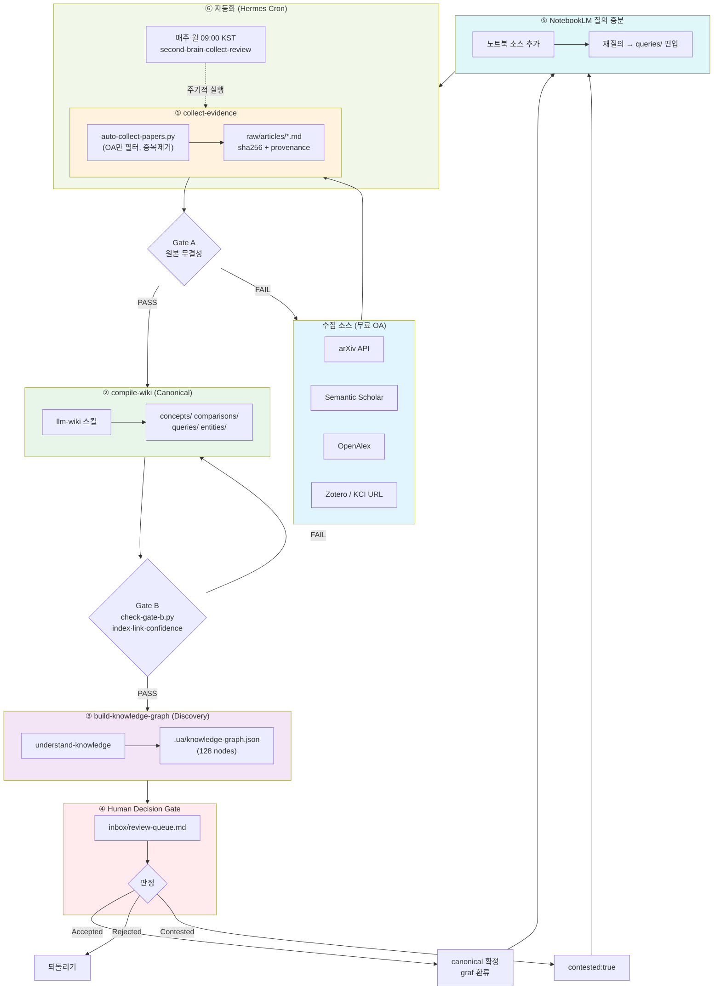

```mermaid
flowchart TD
    subgraph SRC["수집 소스 (무료 OA)"]
        A1[arXiv API]
        A2[Semantic Scholar]
        A3[OpenAlex]
        A4[Zotero / KCI URL]
    end

    SRC --> COLL

    subgraph COLL["① collect-evidence"]
        COLL1["auto-collect-papers.py<br/>(OA만 필터, 중복제거)"]
        COLL2["raw/articles/*.md<br/>sha256 + provenance"]
        COLL1 --> COLL2
    end

    COLL --> GA{"Gate A<br/>원본 무결성"}

    GA -->|PASS| COMP
    GA -->|FAIL| SRC

    subgraph COMP["② compile-wiki (Canonical)"]
        COMP1["llm-wiki 스킬"]
        COMP2["concepts/ comparisons/<br/>queries/ entities/"]
        COMP1 --> COMP2
    end

    COMP --> GB{"Gate B<br/>check-gate-b.py<br/>index·link·confidence"}

    GB -->|PASS| DISC
    GB -->|FAIL| COMP

    subgraph DISC["③ build-knowledge-graph (Discovery)"]
        DISC1["understand-knowledge"]
        DISC2[".ua/knowledge-graph.json<br/>(128 nodes)"]
        DISC1 --> DISC2
    end

    DISC --> HUMAN

    subgraph HUMAN["④ Human Decision Gate"]
        H1["inbox/review-queue.md"]
        H2{"판정"}
        H1 --> H2
    end

    H2 -->|Accepted| CANONOK["canonical 확정<br/>graf 환류"]
    H2 -->|Rejected| DROP["되돌리기"]
    H2 -->|Contested| CONT["contested:true"]

    CANONOK --> NB
    CONT --> NB

    subgraph NB["⑤ NotebookLM 질의 증분"]
        NB1["노트북 소스 추가"]
        NB2["재질의 → queries/ 편입"]
        NB1 --> NB2
    end

    NB --> CRON

    subgraph CRON["⑥ 자동화 (Hermes Cron)"]
        CR1["매주 월 09:00 KST<br/>second-brain-collect-review"]
        CR1 -.주기적 실행.-> COLL
    end

    style SRC fill:#e1f5ff
    style COLL fill:#fff3e0
    style COMP fill:#e8f5e9
    style DISC fill:#f3e5f5
    style HUMAN fill:#ffebee
    style NB fill:#e0f7fa
    style CRON fill:#f1f8e9
```
